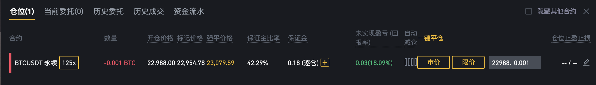

# 第十五课: 为什么合约(期货)危险？现货和合约(期货)的交易你要了解的东西

## 现货和合约
1. 现货就是简单的买卖。但是首先你得有(买), 然后才能卖(无)

2. 现货有什么局限性？(1)
   只能买，然后在卖，只能在上涨过程中赚钱，下跌过程是不能赚钱的(类似A股),
   要想赚钱，只能等牛市, (2)
   你有多少钱，就只能买多少钱的东西，没法扩大你的资金利用率。

3. 那么合约 Contract,或者叫期货Future, 解决了从无到有，和从有到无的过程。
  开仓和平仓。
   
4. 合约自带杠杆, 最高125倍杠杆。那么就容易导致梭哈亏光，
   也可能暴富。但是这一刻可能不会到来。
   
5. 有杠杆就是涉及到借贷，或者说信用问题。那么就是保证金问题。你最多亏的就是你的保证金(破产，爆仓价格也叫破产价),
   如果你把全部本金作为保证金，那么你最多就是亏光你的所有本金。看看中行的原油宝事件，亏光本金还倒贴欠债，就是很不合理啊。想想下！！！
   

## 合约需要保证金保证金交易

1. 合约介绍参考文档:
   [https://www.binancezh.pro/cn/support/faq/c-4?navId=4](https://www.binancezh.pro/cn/support/faq/c-4?navId=4)

2. 强平文档: [https://www.binancezh.pro/cn/support/faq/360033525271](https://www.binancezh.pro/cn/support/faq/360033525271)

3. 标记价格和市场价格的区别。
   1. 标记价格是多个市场的均价。
   2. 市场价格是当前交易的市场的价格。
   
4. 维持保证金: [https://www.binancezh.pro/cn/support/faq/360033162192](https://www.binancezh.pro/cn/support/faq/360033162192)

5. 资金费率:
   永续合约为了让它的价格回归现货，跟现货价格一致。所以设置一个收费制度。就是价格高于现货，多头给这个手续费。价格低于这个现货，空头给这个钱。每8小时计算一次。
   想象为啥？

6. 爆仓清算
   **用户爆仓时，保险金基金会收取一定比例的清算金，交易历史记录中标记为“爆仓清算”。但建议用户严格控制风险，避免爆仓。
   用户的强平价格并不会因此发生变化。**
   
   1. 清算费率: BTC 0.5%, ETH等75倍的0.75%, 最高50倍的交易对1%
  
6. 如何计算爆仓价格:
 
    
    
   1.  开仓价 22988.00, 爆仓价格: 23079.59, 仓位
   2.  按理说你是要亏掉0.18的时候，你才爆仓，但是真实是你什么时候爆仓呢？
   3.  什么时候亏掉0.18呢？ (x-22988) * 0.001 = 0.18 => 0.18/0.001+22988 =
       23168 
   4. 但是真实是23079.59 就爆仓了。为啥呢？ => 它有个千分之5的清算手续费。 0.18
      \- 22988.00 * 0.001 * 0.005 = 0.06506, 所以你的爆仓价格是:
      0.06506/0.001+22988 = 23053, 这个是市场价格
            
      通过维持保证金来计算： 初始保证金 - 维持保证金 = 你的亏损的金额.
      维持保证金和初始保证金。 125倍的初始保证金是1/125 = 0.8%
        
      1. (x-22988) * 0.001 = 22988 * 0.001* 0.8% - 22988 * 0.001 * 0.004 
      2. x = (22988 * 0.8% * 0.001 - 22988 * 0.001 * 0.004)/0.001 +
         22988
      3. 维持保证金是0.4%
## 那么我们交易用多少倍杠杆呢？

1. 要在爆仓价格前设置止损。这样你的钱能少亏很多。少亏你开仓仓位价值的0.5%。
2. 如果你做到上面第一点。那么你开仓倍数没有太大的关系。
3. 计算看看 

   1.  假设你有10,000元。一倍杠杆，也就是不加杠杆，只用自己的本金。全仓梭哈 
   2.  我用10倍杠杆, 买入10000元的资产，这时保证金是1000元。 
   3.  我100倍杠杆, 买入10000元的资产，保证金是100元。
   
   以上三种情况，它的爆仓价是多少呢？
   1. 一倍杠杆的，你的10000块钱亏光就会爆仓。涨到价格翻倍就会爆仓。
   2. 如果你全仓跟1倍杠杆是一样的，但是如果逐仓就不一样
   
   3. 1% - 0.4% = 0.6%
   4. 10% - 0.4% = 9.6%
   
## 注意
1. 合约交易一定要在爆仓前设置止损，能帮助节省很多钱。 100万, -> 5000 1W * 0.005
   10000* 0.0005 =50
 
2. 如果你是一个严格设置止损的交易者，杠杆倍数多少没什么关系。但是杠杆越大，月容易爆仓。
3. 一般设置倍数在20倍以内就够了。
4. 合理利用逐仓能保证你的资金安全。

## 币安邀请链接

1. 币安邀请链接: https://www.binancezh.pro/cn/futures/ref/51bitquant
2. 合约邀请码：51bitquant

